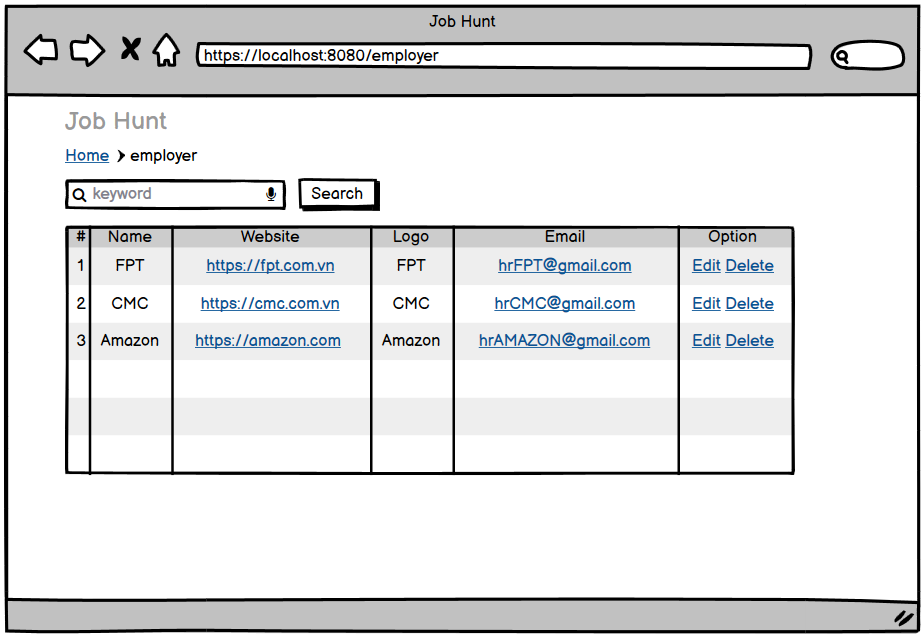
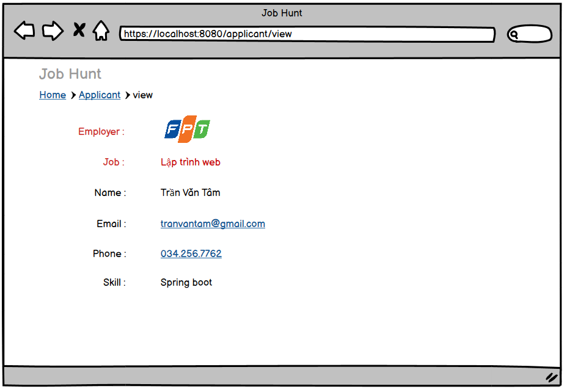

<b>1. List Employers

2. Add Employer

3. Edit Employer

4. View Employer

5. Add Job

6. List Job + chức năng tìm kiếm theo keyword và thành phố

7. View Job

8. Apply Job --> tạo ra Applicant, và gửi email đến Employer

9. List Applicants

10. View Applicant</b>

